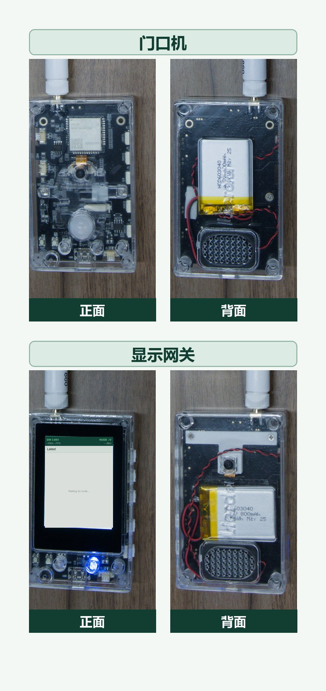
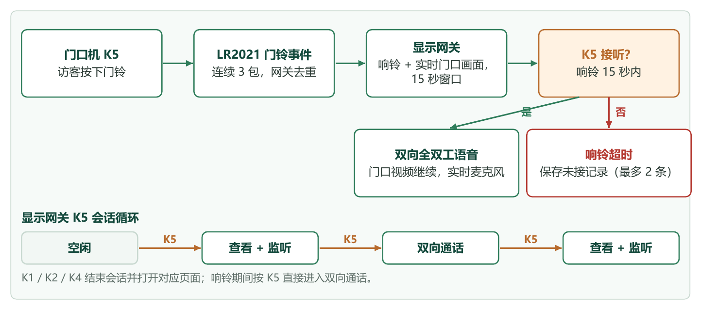

# AM36 Electronic Doorbell

语言：中文 | [English](README_EN.md)

AM36 Electronic Doorbell 是一套基于利尔达 AM36 ESP32-S3 与 LR2021 平台的开源双机视频门铃演示。两台设备使用同一份固件：一台作为室外门口机，另一台作为室内显示网关；所选角色保存在 NVS 中，重启后继续生效。

门口机向显示网关提供单向实时视频上行和门口声音；接听后，系统在继续显示门口视频的同时建立双向全双工语音。门铃无人接听时，网关可在 PSRAM 中保存最多 2 条未接音视频记录；门口机的可选 PIR 传感器还可主动推送最多 5 张移动抓拍。



## 目录

- [主要功能](#主要功能)
- [硬件平台与设备角色](#硬件平台与设备角色)
- [外购配件与 PIR 接线](#外购配件与-pir-接线)
- [说明文档与硬件资料](#说明文档与硬件资料)
- [门铃、监听与通话](#门铃监听与通话)
- [访客记录与 PIR 抓拍](#访客记录与-pir-抓拍)
- [按键与角色切换](#按键与角色切换)
- [触摸与网关页面](#触摸与网关页面)
- [设置项](#设置项)
- [低功耗模式](#低功耗模式)
- [开发要求](#开发要求)
- [编译与烧录](#编译与烧录)
- [基本使用](#基本使用)
- [仓库结构](#仓库结构)
- [许可证与版本](#许可证与版本)

## 主要功能

- SP0A39 彩色摄像头采集与 JPEG 编码。
- 使用 LR2021 FLRC 传输连续门口图像和 Opus 语音。
- 门口机向网关单向实时视频上行，通话时提供双向全双工语音。
- 门铃触发后，网关响铃并显示门口画面，接听窗口为 15 秒。
- 网关可主动查看并监听门口，再通过同一按键进入或退出双向通话。
- 语音链路包含声学回声消除与啸叫抑制。
- 最多保存 2 条未接音视频记录，以及 5 张 PIR 移动抓拍。
- 可选低功耗门口机模式：LoRa CAD 待机，唤醒后切换到 FLRC 业务传输。
- 网关显示两端电压、传输速率、帧率、RSSI、事件时间、麦克风状态和未读访客数。

未接记录和 PIR 抓拍仅保存在网关 PSRAM 中，重启或断电后会丢失。当前固件不提供 HTTP 图库或持久化访客存储。



## 硬件平台与设备角色

项目使用两套相同的 **利尔达 L-LRMAM36-FANN4-DK01 开发套件**。开发套件包含 ESP32-S3、LR2021、SP0A39 摄像头接口、ST7789V3 LCD、触摸控制器、ES8311 音频编解码器、麦克风、扬声器通路和实体按键。外壳、开发板、原理图、PCB 与结构件和 [AM36-WildCam](https://github.com/lierda-iot/WildCam-LR) 使用相同硬件。

<p align="center">
  <a href="https://item.taobao.com/item.htm?id=1074290287510"></a><br>
  <sub>利尔达 L-LRMAM36-FANN4-DK01 开发套件（点击图片打开购买页面）</sub>
</p>

| 角色 | 套件与外购件 | 用途 |
| --- | --- | --- |
| 室外门口机 | [利尔达 L-LRMAM36-FANN4-DK01 开发套件](https://item.taobao.com/item.htm?id=1074290287510)（https://item.taobao.com/item.htm?id=1074290287510） + 可选 [AM312 PIR 感应模块](https://e.tb.cn/h.8QmQiC5bW3w6Jr4?tk=MG18TXmjFKS)（https://e.tb.cn/h.8QmQiC5bW3w6Jr4?tk=MG18TXmjFKS） | 门铃触发、摄像头和麦克风采集、PIR 抓拍、LR2021 发送。 |
| 室内显示网关 | [利尔达 L-LRMAM36-FANN4-DK01 开发套件](https://item.taobao.com/item.htm?id=1074290287510)（https://item.taobao.com/item.htm?id=1074290287510） | 响铃、显示门口画面、监听、双向通话、访客记录和设置。 |

除单独外购的 AM312 PIR 感应模块外，项目所需的其他硬件均由 DK01 开发套件提供，不再拆分列出。购买链接来自硬件厂商提供的淘宝商品入口；库存、套装内容、价格和商品信息以销售页面为准。

## 外购配件与 PIR 接线

门口机的 PIR 移动抓拍功能需要外接一个 AM312 微型热释电红外感应模块；不使用 PIR 抓拍时可以不接。

| 外购配件 | 用途 | 购买链接 |
| --- | --- | --- |
| AM312 微型人体红外感应模块 | 检测人体移动产生的红外变化，并触发门口机抓拍推送到网关 | [淘宝：微型 AM312 人体红外线感应模块](https://e.tb.cn/h.8QmQiC5bW3w6Jr4?tk=MG18TXmjFKS)（https://e.tb.cn/h.8QmQiC5bW3w6Jr4?tk=MG18TXmjFKS） |

请断电后接线，并优先使用开发板的 3.3 V 电源：

| AM312 引脚 | 连接到 L-LRMAM36-FANN4-DK01 | 说明 |
| --- | --- | --- |
| `VCC` | `3V3` | 建议使用 3.3 V 供电，避免把高于 3.3 V 的信号送入 ESP32-S3。 |
| `OUT` | `GPIO12` | 固件配置为输入下拉和高电平触发。 |
| `GND` | `GND` | AM312 与开发板必须共地。 |

PIR 仅用于**门口机角色**。`GPIO12` 在显示网关角色中同时用于触摸屏中断，因此不要在网关上连接 AM312。接线排针或焊盘位置请以 DK01 板卡丝印和硬件资料为准。

固件启动约 5 秒后才对 `GPIO12` 布防。AM312 输出高电平时立即抓拍一张图片推送到网关，触发后等待 15 秒再重新布防；在低功耗模式下，高电平还可以唤醒门口机并启动抓拍上传。使用前需要在网关设置页开启 `PIR Motion`，该配置会发送到门口机并保存在 NVS 中。

## 说明文档与硬件资料

- [中文功能说明](docs/guides/AM36_Electronic_Doorbell_Feature_Guide_ZH.pdf)
- [英文功能说明](docs/guides/AM36_Electronic_Doorbell_Feature_Guide.pdf)
- [DK01 开发套件原理图](docs/hardware/schematic/L-LRMAM36-FANN4-DK01_SCH.pdf)
- [DK01 开发套件 PCB 源文件](docs/hardware/pcb/L-LRMAM36-FANN4-DK01_PCB.PcbDoc)
- [7 个 STEP 外壳与结构件](docs/3d-print/README.md)

## 门铃、监听与通话

### 门铃呼叫

1. 访客短按门口机 `K5`。
2. 显示网关响铃，并尝试显示门口实时画面。
3. 在 15 秒响铃窗口内短按网关 `K5`，可直接接听并进入双向语音通话。
4. 15 秒内无人接听时，网关结束实时流，并将收到的音视频保留为未接记录。

同一访客会话仍在进行时，重复按铃不会叠加新的响铃。已接听的会话，或通过导航键主动离开的会话，不保存为未接记录。

### 主动查看与通话循环

网关 `K5` 和设置页中的 `CAPTURE` 使用同一套会话状态机：

1. 空闲时第一次操作：查看并监听门口。视频和门口机麦克风数据上行到网关，网关麦克风保持关闭。
2. 监听时第二次操作：进入双向全双工语音通话，门口实时视频继续显示。
3. 通话时第三次操作：结束双向语音，并返回查看和监听状态。

门铃响起时操作 `K5` 会跳过第一步，直接接听。短按 `K1`、`K2` 或 `K4` 会离开当前会话并打开对应页面。

## 访客记录与 PIR 抓拍

网关的 `Visitors` 页面分成两组：

- `MISSED CALLS`：最多 2 条无人接听的门铃音视频记录，最新记录排在前面；新记录会淘汰最旧记录。
- `MOTION`：最多 5 张 PIR 移动抓拍，最新图片排在前面；新图片会淘汰最旧图片。

点击未接记录可按原始帧时序回放画面和声音；点击 PIR 缩略图可全屏查看静态图片。点击回放画面或使用导航键可退出。新的未接记录或 PIR 抓拍到达时，状态栏显示未读数量；打开 `Visitors` 页面后清零。

PIR 在门口机启动约 5 秒后布防。检测到 GPIO12 高电平后推送一张图片，并等待 15 秒再重新布防。PIR 抓拍不会强制切换网关当前页面。

## 按键与角色切换

未保存过角色的设备默认以门口机模式启动。角色写入 NVS，重启后保持不变。

| 当前角色 | 操作 | 功能 |
| --- | --- | --- |
| 任意角色 | `RST` | 硬件复位。 |
| 任意角色 | `BOOT` | ESP32-S3 Boot/下载模式按键；当前固件不分配普通应用功能。 |
| 任意角色 | 电池供电时长按 `K3` | 硬件开关机；该键不进入固件按键扫描。 |
| 门口机 | `K1` | 当前未分配。 |
| 门口机 | 短按 `K2` | 保存显示网关角色并重启。 |
| 门口机 | `K4` | 当前未分配。 |
| 门口机 | 短按 `K5` | 发送门铃事件。 |
| 显示网关 | 短按 `K1` | 打开最新图像页面，并结束当前会话。 |
| 显示网关 | 长按 `K1` 至少 1.5 秒后松开 | 保存门口机角色并重启。 |
| 显示网关 | 短按 `K2` | 打开设置页面，并结束当前会话。 |
| 显示网关 | 短按 `K4` | 打开访客记录页面，并结束当前会话。 |
| 显示网关 | 短按 `K5` | 查看/监听、进入或退出通话；响铃时接听。 |

## 触摸与网关页面

显示网关支持触摸操作：

- 空闲或查看/监听时，可左右滑动在 `Latest`、`Visitors` 和 `Settings` 三个页面之间循环切换；从图像页划走会结束普通查看/监听流。
- 图片接收页不响应左右滑动，避免传输中误切页面。
- 点击设置页控件可发起会话、切换 PIR/低功耗和调整音量。
- 点击访客缩略图可回放未接记录或查看 PIR 抓拍。
- 点击回放画面可停止回放并返回访客列表。

状态栏显示网关与门口机电压、实时 KB/s、画面 FPS、RSSI、最近事件时间、麦克风状态和未读访客数量。通话中可短按实体 `K1`、`K2` 或 `K4` 结束当前会话并跳转页面。

## 设置项

当前 `Settings` 页面只有五项操作：

| 设置项 | 功能 |
| --- | --- |
| `CAPTURE` | 与网关 `K5` 相同：启动查看/监听，并在后续操作中进入或退出双向通话。 |
| `PIR Motion` | 开启或关闭门口机 PIR 抓拍。 |
| `Volume` | 网关播放音量在 0 至 15 之间循环，每档约 8.5 dB，15 为最大。 |
| `JPEG Quality` | 门口机图像编码质量，在 15 至 95 之间以 10 为步进循环，默认 25。数值越高画面越清晰，每帧也更大。 |
| `Low Power` | 开启或关闭门口机 LoRa CAD 低功耗待机。 |

PIR、低功耗和 JPEG 质量只有在与门口机的配置交互成功后才更新，并保存在门口机 NVS 中；网关另存一份用于显示。音量保存在网关 NVS 中。

## 低功耗模式

低功耗模式下，门口机主要处于 LoRa CAD 监听和轻睡眠状态。网关发起查看或通话前先发送 LoRa 长前导唤醒，再切换到 FLRC 传输；门铃键和 PIR 也可以唤醒门口机并启动对应流程。

每次低功耗唤醒打开一个最长 15 秒的 FLRC 通信窗口，图像传输和通话都受该窗口限制。窗口结束后，门口机释放摄像头资源并返回 CAD 待机。需要持续查看或更长通话时，应关闭低功耗模式。

## 开发要求

- 两套利尔达 L-LRMAM36-FANN4-DK01 开发套件。
- 如需移动抓拍，准备一个外接 AM312 PIR 模块。
- USB 数据线及所需的 USB 转串口驱动。
- 必须使用 [ESP-IDF](https://github.com/espressif/esp-idf) v5.5.3。
- ESP-IDF 安装程序提供的 Python 和编译工具。
- 首次解析 ESP-IDF Component Manager 依赖时需要访问网络。

项目目标为 `esp32s3`，当前配置使用 8 MB Flash、自定义 `partitions.csv`、240 MHz CPU 和 80 MHz Octal PSRAM。

当前固件固定使用 915.12 MHz、2.6 Mbit/s FLRC 和最高 22 dBm 发射功率，没有运行时频率选择器。使用者必须根据部署地区的无线电法规确认频率和发射功率是否合法。

## 编译与烧录

### 使用 VS Code

1. 克隆仓库并使用 Visual Studio Code 打开仓库根目录。
2. 安装 Espressif 官方 ESP-IDF 扩展。
3. 选择已安装的 ESP-IDF v5.5.3 环境。
4. 选择目标芯片 `esp32s3`，再点击状态栏中的 `Build`。
5. 连接开发板，在状态栏选择串口，然后执行 `Flash`；需要时使用 `Monitor` 查看日志。

### 使用 ESP-IDF 终端

在仓库根目录执行：

```console
idf.py set-target esp32s3
idf.py build
```

首次构建时，ESP-IDF Component Manager 会根据 `main/idf_component.yml` 和 `dependencies.lock` 下载锁定的组件。`lierda-iot/esp_lora_driver` `0.0.7` 与参考工程相同，来自 Espressif staging registry，因此首次构建需要网络连接。

如果需要从全新配置开始：

```console
idf.py fullclean
idf.py set-target esp32s3
idf.py build
```

构建成功后，将 `COMx` 替换为实际串口：

```console
idf.py -p COMx flash monitor
```

按 `Ctrl+]` 退出监视器，然后对第二块开发板烧录同一固件。

## 基本使用

1. 将同一份固件烧录到两套 DK01 开发套件。
2. 首次启动时两块板均默认为门口机；在其中一块上短按 `K2`，使其保存显示网关角色并重启。
3. 如需 PIR，将 AM312 接到门口机的 `3V3`、`GPIO12` 和 `GND`，再在网关设置页开启 `PIR Motion`。
4. 短按门口机 `K5` 测试响铃；在 15 秒内短按网关 `K5` 接听。
5. 空闲时短按网关 `K5` 可主动查看并监听门口，再次短按进入通话。
6. 使用 `K4` 查看未接记录和 PIR 抓拍，使用 `K2` 调整设置，使用 `K1` 返回最新图像。

## 仓库结构

```text
.
|-- main/                              应用、无线、摄像头、音频、UI 和 BSP
|-- docs/guides/                       中英文功能说明
|-- docs/images/                       README、流程图和 UI 图片
|-- docs/3d-print/                     7 个 STEP 外壳与结构件
|-- docs/hardware/schematic/           DK01 原理图与 Altium 设计资料
|-- docs/hardware/pcb/                 DK01 PCB 源文件
|-- CMakeLists.txt                     ESP-IDF 工程入口
|-- sdkconfig                          当前工程配置
|-- sdkconfig.defaults                 重新生成配置时使用的默认值
|-- partitions.csv                     8 MB Flash 分区表
|-- dependencies.lock                  已解析的组件版本
|-- version.txt                        固件版本唯一来源
|-- CHANGELOG.md                       版本历史
|-- THIRD_PARTY_NOTICES.md             第三方源码与依赖声明
`-- LICENSE                            BSD-3-Clause 许可证
```

## 许可证与版本

AM36 Electronic Doorbell 使用 [BSD-3-Clause 许可证](LICENSE)发布，版权主体为 Lierda Science&Technology Group Co.,Ltd。

第三方源码、组件和硬件资料继续适用各自的许可与署名要求，详情见 [THIRD_PARTY_NOTICES.md](THIRD_PARTY_NOTICES.md)。固件版本由 [version.txt](version.txt) 提供，并记录在 [CHANGELOG.md](CHANGELOG.md) 中；发布标签使用 `vMAJOR.MINOR.PATCH` 格式。
