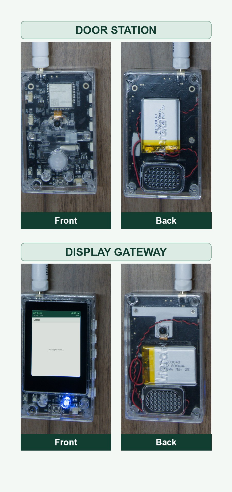
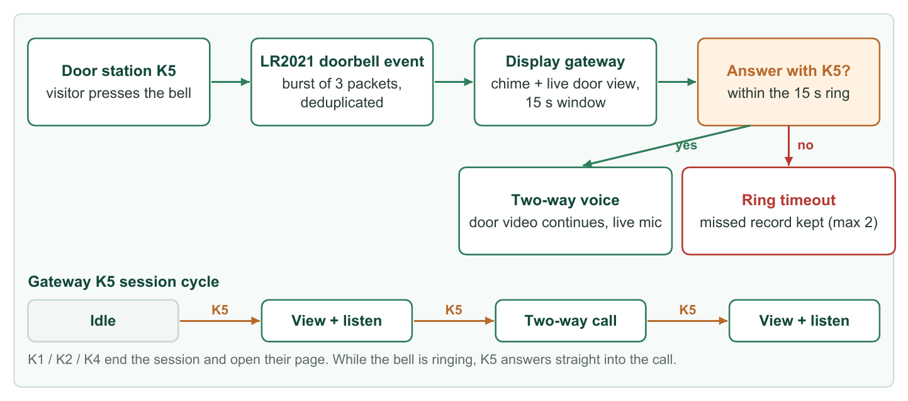
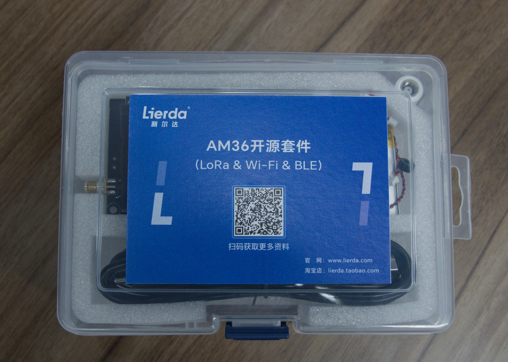

# AM36 Electronic Doorbell

Language: [中文](README.MD) | English

AM36 Electronic Doorbell is an open-source two-device video-doorbell demonstration built on the Lierda AM36 ESP32-S3 and LR2021 platform. Both devices run the same firmware: one operates as the outdoor door station and the other as the indoor display gateway. The selected role is stored in NVS and remains active after a restart.

The door station provides a one-way live video uplink and door-side audio to the display gateway. Answering keeps the door video on screen while opening full-duplex two-way voice. If a ring is not answered, the gateway can retain up to two missed audio/video records in PSRAM. An optional PIR sensor on the door station can also push up to five motion snapshots.



## Table of Contents

- [Features](#features)
- [Hardware Platform and Roles](#hardware-platform-and-roles)
- [External Accessories and PIR Wiring](#external-accessories-and-pir-wiring)
- [Documentation and Hardware Files](#documentation-and-hardware-files)
- [Ringing, Listening, and Calling](#ringing-listening-and-calling)
- [Visitor Records and PIR Snapshots](#visitor-records-and-pir-snapshots)
- [Buttons and Role Switching](#buttons-and-role-switching)
- [Touch Controls and Gateway Pages](#touch-controls-and-gateway-pages)
- [Settings](#settings)
- [Low-Power Mode](#low-power-mode)
- [Requirements](#requirements)
- [Build and Flash](#build-and-flash)
- [Basic Use](#basic-use)
- [Repository Layout](#repository-layout)
- [License and Versioning](#license-and-versioning)

## Features

- SP0A39 color-camera capture with JPEG encoding.
- Continuous door-side images and Opus voice over LR2021 FLRC.
- One-way live video from the door station to the gateway, with full-duplex two-way voice during a call.
- A 15-second answer window in which the gateway rings and shows the door view.
- Gateway-initiated door viewing and listening, followed by a call through the same control.
- Acoustic echo cancellation and howl suppression on the voice path.
- Up to two missed audio/video records and five PIR motion snapshots.
- Optional low-power door-station operation using LoRa CAD standby before FLRC traffic.
- On-screen gateway/node voltage, throughput, frame rate, RSSI, event age, microphone state, and unseen-visitor count.

Missed records and PIR snapshots exist only in gateway PSRAM and are lost after a restart or power loss. The current firmware does not provide an HTTP gallery or persistent visitor storage.



## Hardware Platform and Roles

The project uses two identical **Lierda L-LRMAM36-FANN4-DK01 development kits**. Each kit provides the ESP32-S3, LR2021, SP0A39 camera interface, ST7789V3 LCD, touch controller, ES8311 audio codec, microphone, speaker path, and physical buttons. The enclosure, development board, schematic, PCB, and structural parts are the same hardware distributed with [AM36-WildCam](https://github.com/lierda-iot/WildCam-LR).

<p align="center">
  <a href="https://item.taobao.com/item.htm?id=1074290287510"></a><br>
  <sub>Lierda L-LRMAM36-FANN4-DK01 development kit (click the image to open the purchase page)</sub>
</p>

| Role | Kit and external accessory | Purpose |
| --- | --- | --- |
| Outdoor door station | [Lierda L-LRMAM36-FANN4-DK01 development kit](https://item.taobao.com/item.htm?id=1074290287510) (https://item.taobao.com/item.htm?id=1074290287510) + optional [AM312 PIR sensor module](https://e.tb.cn/h.8QmQiC5bW3w6Jr4?tk=MG18TXmjFKS) (https://e.tb.cn/h.8QmQiC5bW3w6Jr4?tk=MG18TXmjFKS) | Doorbell trigger, camera and microphone capture, PIR snapshots, and LR2021 transmission. |
| Indoor display gateway | [Lierda L-LRMAM36-FANN4-DK01 development kit](https://item.taobao.com/item.htm?id=1074290287510) (https://item.taobao.com/item.htm?id=1074290287510) | Ringing, door video, listening, two-way calls, visitor records, and settings. |

Except for the separately purchased AM312 PIR sensor module, the other required hardware is supplied as part of the DK01 development kit and is not listed separately. The purchase links point to Taobao items supplied by the hardware vendor. Availability, package contents, pricing, and product information are subject to the sales pages.

## External Accessories and PIR Wiring

PIR motion snapshots on the door station require an external AM312 miniature pyroelectric infrared module. It can be omitted when motion snapshots are not needed.

| External accessory | Purpose | Purchase link |
| --- | --- | --- |
| AM312 miniature PIR motion sensor module | Detects changes in infrared radiation caused by a moving person and triggers a door-station snapshot that is pushed to the gateway | [Taobao: AM312 miniature PIR motion sensor module](https://e.tb.cn/h.8QmQiC5bW3w6Jr4?tk=MG18TXmjFKS) (https://e.tb.cn/h.8QmQiC5bW3w6Jr4?tk=MG18TXmjFKS) |

Disconnect power before wiring. Use the board's 3.3 V supply where possible:

| AM312 pin | Connect to L-LRMAM36-FANN4-DK01 | Notes |
| --- | --- | --- |
| `VCC` | `3V3` | A 3.3 V supply is recommended so that no signal above 3.3 V is presented to the ESP32-S3. |
| `OUT` | `GPIO12` | The firmware configures this pin as a pulled-down input with an active-high trigger. |
| `GND` | `GND` | The AM312 and development board must share ground. |

The PIR input is intended for the **door-station role only**. In the display-gateway role, `GPIO12` is also assigned to the touch-panel interrupt, so do not connect the AM312 to a gateway. Use the DK01 silkscreen and hardware documentation to identify the physical header or pad.

The firmware arms `GPIO12` about 5 seconds after startup. A high output from the AM312 immediately captures one image and pushes it to the gateway; after a trigger, the firmware waits 15 seconds before re-arming. In low-power mode, the active-high signal can also wake the door station and start the capture and upload. Enable `PIR Motion` on the gateway Settings page before use; the setting is sent to the door station and stored in NVS.

## Documentation and Hardware Files

- [English Feature Guide](docs/guides/AM36_Electronic_Doorbell_Feature_Guide.pdf)
- [Chinese Feature Guide](docs/guides/AM36_Electronic_Doorbell_Feature_Guide_ZH.pdf)
- [DK01 development-kit schematic](docs/hardware/schematic/L-LRMAM36-FANN4-DK01_SCH.pdf)
- [DK01 development-kit PCB source](docs/hardware/pcb/L-LRMAM36-FANN4-DK01_PCB.PcbDoc)
- [Seven STEP enclosure and structural files](docs/3d-print/README.md)

## Ringing, Listening, and Calling

### Doorbell Ring

1. The visitor short-presses door-station button `K5`.
2. The display gateway rings and attempts to show the live door view.
3. Short-press gateway button `K5` within the 15-second ring window to answer directly into a two-way voice call.
4. If the ring is not answered within 15 seconds, the gateway ends the live stream and retains the received audio/video as a missed record.

Repeated presses do not queue additional rings while the same visitor session is open. Answered sessions, and sessions dismissed with a navigation button, are not retained as missed records.

### View, Listen, and Call Cycle

Gateway button `K5` and the Settings-page `CAPTURE` control use the same session state machine:

1. First action from idle: view and listen at the door. Video and door-station microphone data travel to the gateway while the gateway microphone remains closed.
2. Second action while listening: open full-duplex two-way voice while the live door video remains on screen.
3. Third action during a call: end two-way voice and return to viewing and listening.

During a ring, `K5` skips the first step and answers directly. Short-press `K1`, `K2`, or `K4` to leave the current session and open the corresponding page.

## Visitor Records and PIR Snapshots

The gateway `Visitors` page contains two sections:

- `MISSED CALLS`: up to two unanswered doorbell audio/video records, newest first; a new record evicts the oldest.
- `MOTION`: up to five PIR motion snapshots, newest first; a new snapshot evicts the oldest.

Tap a missed record to replay its image frames and audio on the original frame clock. Tap a PIR thumbnail to show the still image full screen. Tap the playback image or use a navigation button to leave playback. When a new missed record or snapshot arrives, the status bar shows an unseen count; opening `Visitors` clears it.

The PIR input is armed about five seconds after the door station starts. A GPIO12 high level pushes one image, after which the input waits 15 seconds before re-arming. A PIR snapshot does not force the gateway away from its current page.

## Buttons and Role Switching

A device with no saved role starts as a door station. The selected role is stored in NVS and survives restart.

| Current role | Control | Action |
| --- | --- | --- |
| Either role | `RST` | Hardware reset. |
| Either role | `BOOT` | ESP32-S3 boot/download strap; no normal application action in the current firmware. |
| Either role | Hold `K3` while battery powered | Hardware power on/off; this key is not scanned by the firmware. |
| Door station | `K1` | Unassigned. |
| Door station | Short press `K2` | Save the display-gateway role and restart. |
| Door station | `K4` | Unassigned. |
| Door station | Short press `K5` | Send a doorbell event. |
| Display gateway | Short press `K1` | Open Latest and end the current session. |
| Display gateway | Hold `K1` for at least 1.5 seconds, then release | Save the door-station role and restart. |
| Display gateway | Short press `K2` | Open Settings and end the current session. |
| Display gateway | Short press `K4` | Open visitor records and end the current session. |
| Display gateway | Short press `K5` | View/listen, enter or leave a call, or answer a ring. |

## Touch Controls and Gateway Pages

The display gateway supports these touch actions:

- While idle or viewing/listening, swipe left or right to cycle through `Latest`, `Visitors`, and `Settings`; swiping away from the image page stops the normal view/listen stream.
- Swipes are ignored on the image-reception page to prevent accidental navigation during transfer.
- Tap Settings controls to start a session, toggle PIR or low power, and adjust volume.
- Tap visitor thumbnails to replay a missed record or view a PIR snapshot.
- Tap the playback image to stop playback and return to the visitor list.

The status bar reports gateway and door-station voltage, live KB/s, displayed FPS, RSSI, last-event age, microphone state, and unseen-visitor count. During a call, short-press physical button `K1`, `K2`, or `K4` to end the active session and open the corresponding page.

## Settings

The current `Settings` page contains five controls:

| Control | Action |
| --- | --- |
| `CAPTURE` | Same state machine as gateway `K5`: start view/listen, then enter or leave two-way voice. |
| `PIR Motion` | Enable or disable door-station PIR snapshots. |
| `Volume` | Cycle gateway playback volume from 0 through 15, about 8.5 dB per step; 15 is the maximum. |
| `JPEG Quality` | Cycle the door-station encoder quality from 15 through 95 in steps of 10; default 25. Higher values give a sharper picture and larger frames. |
| `Low Power` | Enable or disable door-station LoRa CAD standby. |

PIR, low-power, and JPEG-quality state are updated only after a successful configuration exchange with the door station and are stored in door-station NVS; the gateway keeps a copy for display. Volume is stored in gateway NVS.

## Low-Power Mode

In low-power mode, the door station spends most of its time in LoRa CAD listening and light sleep. Before a gateway-initiated view or call, the gateway sends a LoRa long-preamble wake-up and then switches to FLRC traffic. The doorbell key and PIR can also wake the door station and start their respective flows.

Each low-power wake opens an FLRC communication window of at most 15 seconds. Image transfer and a call are both bounded by this window. When it expires, the door station releases camera resources and returns to CAD standby. Disable low-power mode for continuous viewing or a longer call.

## Requirements

- Two Lierda L-LRMAM36-FANN4-DK01 development kits.
- An external AM312 PIR module if motion snapshots are required.
- USB data cables and the required USB-to-serial driver.
- [ESP-IDF](https://github.com/espressif/esp-idf) v5.5.3 is required.
- Python and build tools supplied by the ESP-IDF installer.
- Network access for the first ESP-IDF Component Manager dependency resolution.

The project targets `esp32s3`. The current configuration uses 8 MB flash, the custom `partitions.csv`, a 240 MHz CPU, and 80 MHz Octal PSRAM.

The current firmware uses a fixed 915.12 MHz carrier, 2.6 Mbit/s FLRC, and up to 22 dBm transmit power. It has no runtime frequency selector. Users must confirm that the frequency and transmit power are permitted in the deployment region.

## Build and Flash

### Visual Studio Code

1. Clone the repository and open its root folder in Visual Studio Code.
2. Install the official Espressif ESP-IDF extension.
3. Select an installed ESP-IDF v5.5.3 environment.
4. Select the `esp32s3` target, then use the status-bar `Build` action.
5. Connect the board, select its serial port, and run `Flash`. Use `Monitor` when serial output is needed.

### ESP-IDF Terminal

Run in the repository root:

```console
idf.py set-target esp32s3
idf.py build
```

On the first build, ESP-IDF Component Manager downloads the locked components from `main/idf_component.yml` and `dependencies.lock`. As in the reference project, `lierda-iot/esp_lora_driver` `0.0.7` comes from the Espressif staging registry, so network access is required.

To regenerate configuration from a clean state:

```console
idf.py fullclean
idf.py set-target esp32s3
idf.py build
```

After a successful build, replace `COMx` with the board's serial port:

```console
idf.py -p COMx flash monitor
```

Press `Ctrl+]` to leave the monitor, then flash the same firmware image to the second board.

## Basic Use

1. Flash the same firmware image to two DK01 development kits.
2. Both boards default to the door-station role on first start. Short-press `K2` on one board to save the display-gateway role and restart it.
3. For PIR use, connect the AM312 to `3V3`, `GPIO12`, and `GND` on the door station, then enable `PIR Motion` on the gateway Settings page.
4. Short-press door-station `K5` to test ringing; short-press gateway `K5` within 15 seconds to answer.
5. From idle, short-press gateway `K5` to view and listen at the door, then press it again to enter a call.
6. Use `K4` for missed records and PIR snapshots, `K2` for Settings, and `K1` for the latest image.

## Repository Layout

```text
.
|-- main/                              Application, radio, camera, audio, UI, and BSP
|-- docs/guides/                       English and Chinese feature guides
|-- docs/images/                       README, workflow, and UI images
|-- docs/3d-print/                     Seven STEP enclosure and structural files
|-- docs/hardware/schematic/           DK01 schematic and Altium design files
|-- docs/hardware/pcb/                 DK01 PCB source
|-- CMakeLists.txt                     ESP-IDF project entry point
|-- sdkconfig                          Current project configuration
|-- sdkconfig.defaults                 Defaults used when configuration is regenerated
|-- partitions.csv                     8 MB flash partition table
|-- dependencies.lock                  Resolved component versions
|-- version.txt                        Single source of the firmware version
|-- CHANGELOG.md                       Version history
|-- THIRD_PARTY_NOTICES.md             Third-party source and dependency notices
`-- LICENSE                            BSD-3-Clause license
```

## License and Versioning

AM36 Electronic Doorbell is distributed under the [BSD-3-Clause license](LICENSE), with Lierda Science&Technology Group Co.,Ltd as the copyright holder.

Third-party source, components, and hardware materials retain their applicable terms and attribution; see [THIRD_PARTY_NOTICES.md](THIRD_PARTY_NOTICES.md). The firmware version comes from [version.txt](version.txt) and is recorded in [CHANGELOG.md](CHANGELOG.md). Release tags use the `vMAJOR.MINOR.PATCH` format.
